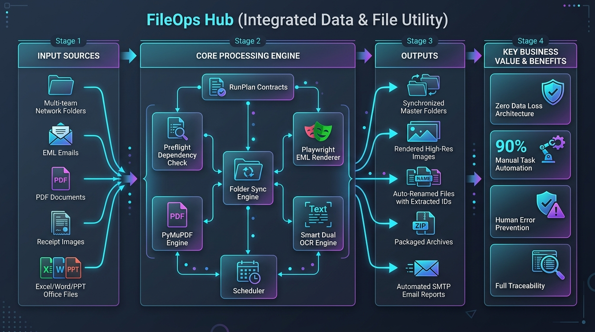

*Read this in other languages: [English](README.md), [한국어](README.ko.md), [Polski](README.pl.md)*

# 📁 FileOps Hub: Cross-Team Document Distribution & Automated Folder Synchronization Hub

  

> **Cross-Team Document Sync · Automated Scheduled Distribution · Elimination of Duplicate Files & Work Gaps**

**FileOps Hub** is a Windows desktop utility designed to manage document distribution and automatic folder synchronization across multiple teams and shared network drives.

In collaborative business environments, teams maintain different versions of master files, approval documents, and operational reports. FileOps Hub automates two-way sync and scheduled distribution between department folders and shared drives, eliminating redundant duplicate files and ensuring that everyone works from the latest materials without operational delays.

## Purpose & Scope

1. **Team Document Hub**: Two-way sync and one-way distribution between departmental working folders and shared sales/operational drives.
2. **Repository-Compatible Conversion**: Converts Excel, PowerPoint, Word, and PDF files into repository-approved formats while preserving file modification timestamps.
3. **Settlement & Audit Preprocessing**: Renders EML (email) and PDF documents into clean images, runs OCR to extract promotion codes and reference numbers, and cleans file names.
4. **Scheduled Execution & Reporting**: Runs background automation at a specified daily time and sends execution reports via SMTP email (with fallback to local logs).

> FileOps Hub does not modify Windows folder ACLs or grant unauthorized access. It operates strictly within the security boundaries of the logged-in Windows user account.

---

## Core Capabilities

1. **Tasks (Unified Runner & Scheduler)**: Chains active tabs into an orchestrated `RunPlan` executed sequentially with preflight safety checks. Daily scheduled background execution with SMTP email notification upon completion.
2. **Sync (Folder Synchronization)**: Supports two-way synchronization and one-way distribution from source to target. Includes subfolder filtering, regex exclusion, and versioned conflict backups.
3. **EML (Email Rendering)**: Renders `.eml` email files into PNG screenshots using a headless Chromium browser engine, skipping unchanged files automatically.
4. **PDF (PDF Page Image Rendering)**: Renders multi-page PDF documents into high-resolution JPG images for review and visual inspection.
5. **OCR (Text Extraction & Renaming)**: Uses local OCR (Windows OCR or Tesseract) to extract invoice/promotion numbers from images and renames files cleanly without naming collisions.
6. **Convert Files (Office & PDF Packaging)**: Automates Excel, Word, and PowerPoint batch conversions using Office COM, and packages PDF archives into ZIP. Features safe original backups and collision-free recovery options.

---

## 🚀 Download & Installation

1. Go to the **[Releases](https://github.com/KwangBeomPark/05_FileOperation/releases)** tab on GitHub.
2. Download the official installer **`App05_FileOps_Setup_vX.Y.Z.exe`** (along with `build-manifest.json` and `SHA256SUMS.txt`).
3. Run the installer. It installs cleanly into `%LOCALAPPDATA%\Programs\FileOps` without requiring UAC administrator elevation.
4. Optionally enable **Start FileOps Hub automatically when Windows starts** for silent background tray scheduling (`--tray`).

---

## 📄 License

This project is licensed under the MIT License. See [LICENSE](LICENSE) for details.
